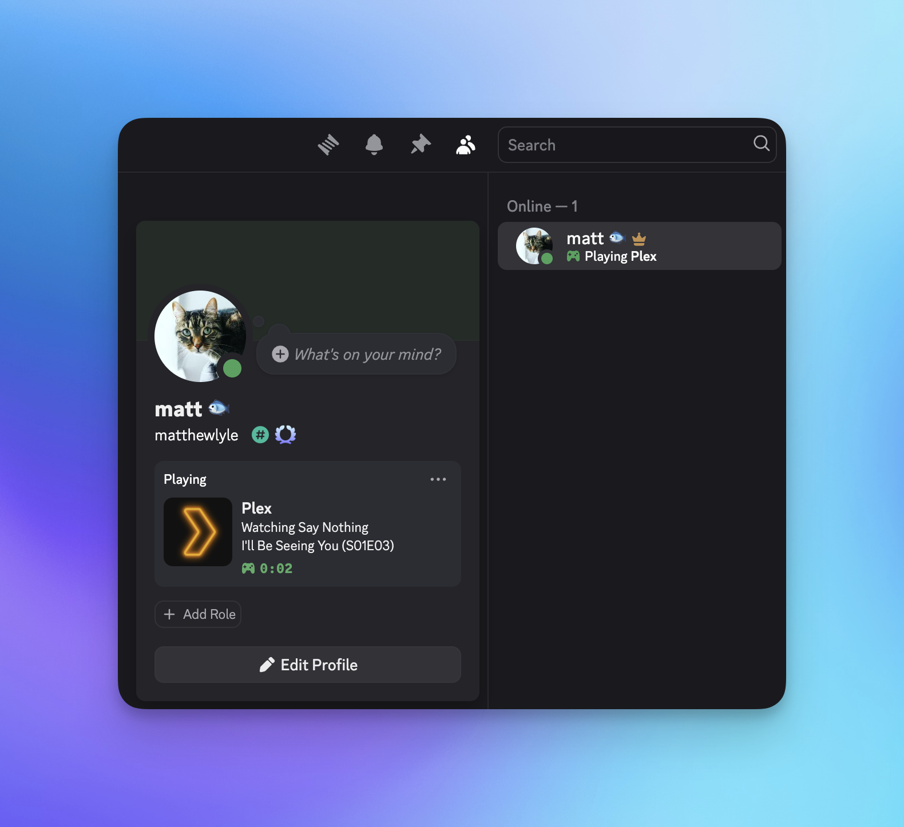

A simple python script that polls a Plex server and updates a Discord profile with what's playing. Works for movies, shows & songs. 

### Usage
1. Create a [Discord application](https://discord.com/developers) and name it whatever you'd like to see inside the application window (e.g Plex, your server name, etc.)
	* (Optional, but feels cooler) Upload a 1024x1024 image under App Icon
2. Download the latest [release](https://github.com/matthewlyle/plex-discord-status/releases)
3. Edit `config.ini` with your Plex token, username and Discord Application ID 
4. Run `./PlexDiscordStatus` from a terminal 

### Limitations 
There are several limitations due to this using the Discord Presence API as opposed to being an official integration like Spotify has.

1. It will always say `Playing {appName}` rather than `Listening to` or `Watching`. 
2. It can only have one application image, i.e it can't show the artwork associated with the playing item 
3. The plugin only works with content from the server specified in config.ini. Not Live TV, AVOD, content from other servers, etc. 
4. The script has to be running

